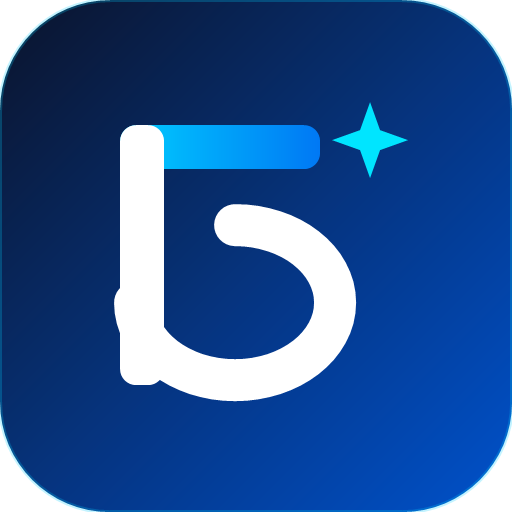

# 🎓 BMSTU Neo

<div align="center">



### Современный, быстрый и удобный мобильный клиент для Личного кабинета студента МГТУ им. Н.Э. Баумана

[](https://flutter.dev)
[](https://dart.dev)
[](LICENSE)
[]()

</div>

---

## 🌟 Возможности приложения

- 📅 **Умное расписание занятий**
  - Поддержка числителя и знаменателя (чётная / нечётная недели) с автоматическим переключением.
  - Удобная навигация свайпами между днями недели.
  - Подробная карточка пары: аудитория, корпус (ГУК, УЛК, ЭМТ и др.), тип занятия (лекция, семинар, лаб.), преподаватели.
  - Возможность добавления собственных пользовательских пар и заметок.

- 📊 **Электронный журнал и балльно-рейтинговая система (БРС)**
  - Актуальный срез успеваемости по всем дисциплинам семестра.
  - Фильтры по типу отчётности: экзамен, дифференцированный зачёт, зачёт, курсовая работа.
  - Детализация по модулям и контрольным точкам.

- 🏃‍♂️ **Модуль физического воспитания (ФОК)**
  - Мониторинг набранных баллов по физкультуре.
  - Отслеживание отработок, посещений и ближайших занятий.

- 🪪 **Профиль студента и цифровой пропуск**
  - Быстрый доступ к данным студенческого билета, шифру группы и семестру.
  - Встроенный генератор QR-кода студента.
  - Поддержка быстрого переключения групп и просмотра расписания других потоков.

- 🔔 **Виджет рабочего стола и Live-трекинг (Android)**
  - Интерактивный виджет расписания для домашнего экрана смартфона.
  - Live-уведомление с таймером до начала/конца текущей пары.

- 📶 **Автономность и офлайн-режим**
  - Локальное кэширование расписания и успеваемости: приложение работает даже в подвальных аудиториях без связи.
  - Индикация статуса синхронизации.

- 🔒 **Приватность и безопасность**
  - Локальное шифрование учётных данных через аппаратный ключ (`flutter_secure_storage` / Keystore / Keychain).
  - Запросы направляются исключительно на официальные серверы авторизации МГТУ им. Н.Э. Баумана. Никакой сторонней телеметрии и сторонних бэкендов.

- 🎨 **Material You & Современный интерфейс**
  - Динамическая цветовая палитра Material 3 под цвет обоев устройства (Dynamic Color) с фирменным бауманским синим акцентом.
  - Полноценная тёмная и светлая темы.

---

## 📂 Структура репозитория

```text
BMSTUneo/
├── .github/                  # CI/CD автоматизация (GitHub Actions)
├── bmstu_lks_flutter/        # Исходный код Flutter-приложения
│   ├── android/              # Нативный код Android (виджеты, сервисы)
│   ├── ios/                  # Нативный код iOS
│   ├── lib/
│   │   ├── constants/        # Версионирование и константы
│   │   ├── models/           # DTO и модели данных (расписание, профиль, БРС)
│   │   ├── providers/        # Управление состоянием (Provider)
│   │   ├── screens/          # Экраны приложения
│   │   ├── services/         # API-клиент, безопасное хранилище, виджет-сервис
│   │   └── widgets/          # UI-компоненты и карточки
│   ├── test/                 # Модульные и интеграционные тесты
│   └── pubspec.yaml          # Зависимости и ресурсы проекта
├── .gitattributes            # Нормализация LF/CRLF и бинарных файлов
├── .gitignore                # Исключение кэшей, секретов и локальных дампов
├── LICENSE                   # Лицензия MIT
└── README.md                 # Документация проекта
```

---

## 🚀 Начало работы

### Требования
- Установленный [Flutter SDK](https://docs.flutter.dev/get-started/install) (версия >= 3.3.0)
- [Dart SDK](https://dart.dev/get-dart)
- Android Studio / VS Code с плагинами Flutter и Dart
- Android SDK (для сборки под Android) или Xcode (для macOS/iOS)

### Установка и запуск

1. **Клонируйте репозиторий:**
   ```bash
   git clone https://github.com/ВАШ_ЛОГИН/BMSTUneo.git
   cd BMSTUneo/bmstu_lks_flutter
   ```

2. **Установите зависимости:**
   ```bash
   flutter pub get
   ```

3. **Запустите приложение на подключенном устройстве или эмуляторе:**
   ```bash
   flutter run
   ```

---

## 🧪 Тестирование

Для запуска набора автоматических тестов выполните:

```bash
cd bmstu_lks_flutter
flutter test
```

Для проверки статического анализатора кода:

```bash
cd bmstu_lks_flutter
flutter analyze
```

---

## 📦 Сборка релизной версии

### Android APK:
```bash
cd bmstu_lks_flutter
flutter build apk --release
```
Готовый файл будет в папке `bmstu_lks_flutter/build/app/outputs/flutter-apk/app-release.apk`.

### Android App Bundle (AAB):
```bash
cd bmstu_lks_flutter
flutter build appbundle --release
```

---

## 🤝 Участие в разработке (Contributing)

Мы приветствуем вклад бауманского сообщества в развитие приложения!

1. Сделайте **Fork** проекта.
2. Создайте ветку для новой функциональности:
   ```bash
   git checkout -b feature/awesome-feature
   ```
3. Зафиксируйте изменения:
   ```bash
   git commit -m "feat: добавлена новая функциональность"
   ```
4. Отправьте ветку в свой репозиторий:
   ```bash
   git push origin feature/awesome-feature
   ```
5. Откройте **Pull Request**.

---

## 📄 Лицензия

Проект распространяется под открытой лицензией [MIT](LICENSE).

<div align="center">
Сделано студентами для студентов МГТУ им. Н.Э. Баумана 💙
</div>
